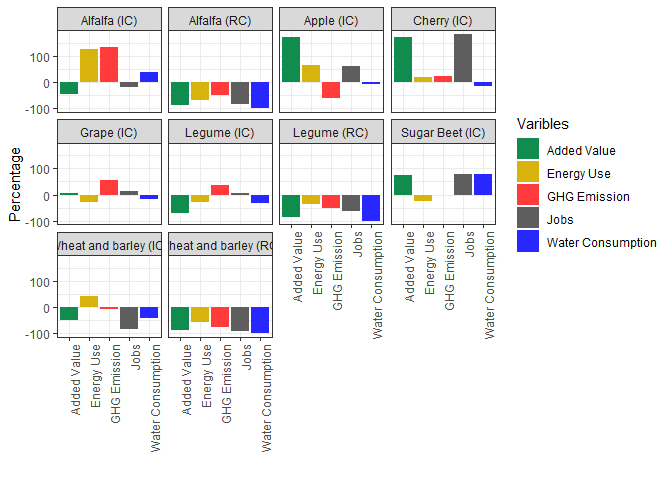

Aras
================
Alireza
10/04/2023

``` r
library(devtools)
library(ggradar)
library(stringr)
library(readxl)
library(tidyverse)
library(fmsb)
library(plotly)
library(hrbrthemes)
library(patchwork)
library(png)


## ---- Barplots for "per hectare" ####
per_hectare <- read_excel("Indicators.xlsx", sheet = "r_perhectare")
per_hectare <- data.frame(per_hectare)
per_hectare$value <- round(per_hectare$value, 0)

ggplot(per_hectare, aes(x=Varibles, y =value, fill= Varibles))+
  geom_bar( stat = "identity" )+
  facet_wrap(~ crop)+
  scale_fill_manual( values = c("#118c4f", "#d8b30d", "#ff3b3b", "#5e5e5e",
                                "#2727ff"))+
  theme_bw()+
  theme(axis.text.x = element_text( angle = 90,  hjust = 1 ))+
  ylab("Percentage")+
  xlab ("")
```

<!-- -->

``` r
#ggsave("Per_hectare.tiff", width = 10, height = 8)
  
## ---- AG time history  ####
iranag_cbi <- read_excel("iranag_cbi.xlsx", sheet = "r")
iranag_cbi <- data.frame(iranag_cbi)


testcpi1 <- iranag_cbi %>% 
  ggplot( aes(x=year, y=Wheat_tht)) +
  geom_area(fill="#69b3a2", alpha=0.5) +
  geom_line(color="#69b3a2") +
  ylab("Wheat Production (Thousand tons)") +
  theme_ipsum()

testcpi2 <- ggplot(iranag_cbi, aes(x=year, y=totprod)) +
  geom_line(color="#69b3a2", size=2) +
  theme_bw()+
  theme(axis.text.x = element_text( angle = 90,  hjust = 1 ),
        plot.title = element_text(face = "bold", size = 12),
        legend.background = element_rect(fill = "white", size = 4, colour = "white"))+
  labs(
    x = "Year",
    y = "Thousand Tons",
    title = "Annual Crop Production"
  )

testcpi3 <- ggplot(iranag_cbi, aes(x=year, y=totland_thh)) +
  geom_line(color="#69b3a2", size=2) +
  theme_bw()+
  theme(axis.text.x = element_text( angle = 90,  hjust = 1 ),
        plot.title = element_text(face = "bold", size = 12),
        legend.background = element_rect(fill = "white", size = 4, colour = "white"))+
  labs(
    x = "Year",
    y = "Thousand Hectares",
    title = "Land Use"
  )


sapply(iranag_cbi, class)
```

    ##             year        Wheat_tht       Barely_tht         Rice_tht 
    ##        "numeric"        "numeric"        "numeric"        "numeric" 
    ##       Cotton_tht    SugarBeet_tht    SugarCane_tht          Tea_tht 
    ##        "numeric"        "numeric"        "numeric"      "character" 
    ##     OilSeeds_tht      Tobacco_tht       Pulses_tht       Potato_tht 
    ##        "numeric"        "numeric"        "numeric"        "numeric" 
    ##        Onion_tht    Pistachio_tht          totprod        Wheat_thh 
    ##        "numeric"        "numeric"        "numeric"        "numeric" 
    ##       Barely_thh         Rice_thh       Cotton_thh    SugarBeet_thh 
    ##        "numeric"        "numeric"        "numeric"        "numeric" 
    ##    SugarCane_thh          Tea_thh     Oilseeds_thh      Tobacco_thh 
    ##      "character"      "character"        "numeric"        "numeric" 
    ##       Pulses_thh       Potato_thh        Onion_thh   Pistachio_thh. 
    ##        "numeric"        "numeric"        "numeric"        "numeric" 
    ##      totland_thh Agri_Imports_tht            ...31            ...32 
    ##        "numeric"      "character"        "logical"        "numeric"

``` r
sapply(iranag_cbi, mode)
```

    ##             year        Wheat_tht       Barely_tht         Rice_tht 
    ##        "numeric"        "numeric"        "numeric"        "numeric" 
    ##       Cotton_tht    SugarBeet_tht    SugarCane_tht          Tea_tht 
    ##        "numeric"        "numeric"        "numeric"      "character" 
    ##     OilSeeds_tht      Tobacco_tht       Pulses_tht       Potato_tht 
    ##        "numeric"        "numeric"        "numeric"        "numeric" 
    ##        Onion_tht    Pistachio_tht          totprod        Wheat_thh 
    ##        "numeric"        "numeric"        "numeric"        "numeric" 
    ##       Barely_thh         Rice_thh       Cotton_thh    SugarBeet_thh 
    ##        "numeric"        "numeric"        "numeric"        "numeric" 
    ##    SugarCane_thh          Tea_thh     Oilseeds_thh      Tobacco_thh 
    ##      "character"      "character"        "numeric"        "numeric" 
    ##       Pulses_thh       Potato_thh        Onion_thh   Pistachio_thh. 
    ##        "numeric"        "numeric"        "numeric"        "numeric" 
    ##      totland_thh Agri_Imports_tht            ...31            ...32 
    ##        "numeric"      "character"        "logical"        "numeric"

``` r
sapply(iranag_cbi, is.character)
```

    ##             year        Wheat_tht       Barely_tht         Rice_tht 
    ##            FALSE            FALSE            FALSE            FALSE 
    ##       Cotton_tht    SugarBeet_tht    SugarCane_tht          Tea_tht 
    ##            FALSE            FALSE            FALSE             TRUE 
    ##     OilSeeds_tht      Tobacco_tht       Pulses_tht       Potato_tht 
    ##            FALSE            FALSE            FALSE            FALSE 
    ##        Onion_tht    Pistachio_tht          totprod        Wheat_thh 
    ##            FALSE            FALSE            FALSE            FALSE 
    ##       Barely_thh         Rice_thh       Cotton_thh    SugarBeet_thh 
    ##            FALSE            FALSE            FALSE            FALSE 
    ##    SugarCane_thh          Tea_thh     Oilseeds_thh      Tobacco_thh 
    ##             TRUE             TRUE            FALSE            FALSE 
    ##       Pulses_thh       Potato_thh        Onion_thh   Pistachio_thh. 
    ##            FALSE            FALSE            FALSE            FALSE 
    ##      totland_thh Agri_Imports_tht            ...31            ...32 
    ##            FALSE             TRUE            FALSE            FALSE

``` r
transform(iranag_cbi, Agri_Imports_tht = as.numeric(Agri_Imports_tht))
```

    ##    year Wheat_tht Barely_tht Rice_tht Cotton_tht SugarBeet_tht SugarCane_tht
    ## 1  1978    3791.0     1133.0    741.0      405.0        3554.0         898.0
    ## 2  1979    4570.0     1411.0    920.0      297.0        3824.0        1399.0
    ## 3  1980    3733.0      979.0    501.0      205.0        3640.0        1000.0
    ## 4  1981    5653.0     1968.0    981.0      248.0        3253.0        1696.0
    ## 5  1982    6660.0     1903.0   1605.0      358.0        4321.0        1810.0
    ## 6  1983    5956.0     2034.0   1215.0      300.0        3648.0        2053.0
    ## 7  1984    6207.0     2293.0   1484.0      351.0        3392.0        2162.0
    ## 8  1985    6631.0     2297.0   1776.0      324.0        3924.0        2413.0
    ## 9  1986    7556.0     2505.0   1784.0      359.0        4965.0        2362.0
    ## 10 1987    7600.0     2731.0   1803.0      341.0        4456.0        1575.0
    ## 11 1988    7265.0     3394.0   1419.0      380.0        3454.0        1299.0
    ## 12 1989    6010.0     2847.0   1854.0      395.0        3535.0        1466.0
    ## 13 1990    8012.0     3548.0   1981.0      436.0        3641.0        1659.0
    ## 14 1991    8793.0     3102.0   2357.0      412.0        5000.0        1374.0
    ## 15 1992   10179.0     3065.0   2364.0      330.0        6005.0        1855.0
    ## 16 1993   10732.0     3058.0   2281.0      275.0        5408.0        1868.0
    ## 17 1994   10870.0     3045.0   2259.0      387.0        5295.0        1857.0
    ## 18 1995   11228.0     2952.0   2301.0      523.0        5521.0        1859.0
    ## 19 1996   10015.0     2736.0   2685.0      598.0        3687.0        1833.0
    ## 20 1997   10045.0     2499.0   2350.0      451.0        4754.0        2059.0
    ## 21 1998   11955.0     3301.0   2771.0      460.0        4987.0        1970.0
    ## 22 1999    8673.0     1999.0   2348.0      441.0        5548.0        2236.0
    ## 23 2000    8088.0     1686.0   1971.0      497.0        4332.0        2367.0
    ## 24 2001    9459.0     2423.0   1990.0      412.0        4649.0        3195.0
    ## 25 2002   12450.0     3085.0   2888.0      345.0        6098.0        3712.0
    ## 26 2003   13440.0     2908.0   2931.0      352.0        5933.0        5196.0
    ## 27 2004   14568.0     2940.0   2543.0      420.0        4916.0        5911.0
    ## 28 2005   14308.0     2857.0   2737.0      363.0        4902.0        5530.0
    ## 29 2006   14664.0     2956.0   2612.0      284.0        6709.0        4959.0
    ## 30 2007   15887.0     3104.0   2664.0      313.0        5407.0        5315.0
    ## 31 2008    7000.0     1547.4   2070.0      295.7        1713.7        3822.7
    ## 32 2009   12093.0     2369.0   2137.0      253.6        2014.9        2821.9
    ## 33 2010   12143.0     3294.0   2490.0      167.4        3866.0        5647.8
    ## 34 2011    8678.0     2534.0   1893.0      270.8        4702.8        5643.4
    ## 35 2012    8816.0     2768.0   2360.0      210.0        4069.8        5361.4
    ## 36 2013    9304.2     2812.1   2450.0      189.6        3467.4        6537.0
    ## 37 2014   10578.7     2955.4   2347.3      184.0        4731.0        6588.6
    ## 38 2015   11522.3     3201.6   2347.7      175.5        5594.2        7407.0
    ## 39 2016   14592.0     3724.4   2921.0      161.2        5965.6        7479.6
    ## 40 2017   12400.0     2974.0   3206.1      180.2        8079.8        7800.0
    ## 41 2018   13300.0     3101.8   3106.4      165.3        7393.6        5100.0
    ## 42 2019   13715.3     3514.3   4422.3      228.8        3833.9        4568.6
    ## 43 2020   13540.5     3874.7   4560.7      278.0        5606.9        7750.6
    ##               Tea_tht OilSeeds_tht Tobacco_tht Pulses_tht Potato_tht Onion_tht
    ## 1                 120        203.0        14.0      203.0      735.0     392.0
    ## 2                 136         99.0        20.0      227.0      997.0     515.0
    ## 3                 116        105.0        15.0      249.0     1338.0     659.0
    ## 4                 147         83.0        21.0      178.0      834.0     348.0
    ## 5                 157        162.0        24.0      296.0     1814.0     965.0
    ## 6                 162        188.0        21.0      290.0     1740.0     736.0
    ## 7                 194        118.0        22.0      303.0     1784.0     844.0
    ## 8                 148        137.0        28.0      343.0     1725.0     719.0
    ## 9                 181        137.0        27.0      376.0     2349.0     824.0
    ## 10                192        226.0        25.0      341.0     2348.0     923.0
    ## 11                193        298.0        21.0      299.0     1443.0     612.0
    ## 12                124        236.0        16.0      264.0     2033.0     692.0
    ## 13                166        145.0        19.0      325.0     2516.0    1213.0
    ## 14                188        137.0        21.0      576.0     2612.0    1125.0
    ## 15                245        267.0        22.0      674.0     2708.0    1305.0
    ## 16                254        316.0        21.0      643.0     3222.0     957.0
    ## 17                248        288.0        10.0      627.0     3185.0    1112.0
    ## 18                243        234.0        14.0      676.0     3074.0    1130.0
    ## 19                277        210.0        17.0      704.0     3140.0    1200.0
    ## 20                309        267.0        24.0      546.0     3284.0    1157.0
    ## 21                270        329.0        23.0      577.0     3430.0    1210.0
    ## 22                275        271.0        22.0      471.0     3433.0    1677.0
    ## 23                223        247.0        21.0      562.0     3658.0    1344.0
    ## 24                228        248.0        20.0      558.0     3486.0    1419.0
    ## 25                213        339.0        27.0      670.0     3756.0    1529.0
    ## 26                212        393.0        22.0      671.0     4211.0    1574.0
    ## 27                134        402.0        13.0      665.0     4454.0    1627.0
    ## 28                197        551.0        22.0      639.0     4830.0    1685.0
    ## 29                155        615.0        15.0      678.0     4219.0    2038.0
    ## 30                 NA        628.0        12.0      711.0     4026.0    2014.0
    ## 31 141.19999999999999        480.6        16.7      370.0     4733.0    1851.0
    ## 32 130.69999999999999        449.0         8.8      421.0     4109.0    1530.0
    ## 33                121        434.0        14.1      419.0     4275.0    1929.0
    ## 34              112.1        424.6        19.2      421.0     4708.0    2173.0
    ## 35              103.9        480.1        19.9      462.0     5069.0    1938.0
    ## 36               97.5        497.4        18.9      505.0     4597.6    2050.0
    ## 37               72.3        344.1        19.0      615.3     4988.7    2065.5
    ## 38               88.3        259.9        23.6      518.6     5140.6    2426.0
    ## 39 144.19999999999999        331.8        21.0      670.6     4995.3    2400.6
    ## 40              108.2        383.3        19.3      699.8     5019.3    2304.9
    ## 41              112.7        522.3        19.4      748.0     5142.9    2421.3
    ## 42 128.69999999999999        661.8        24.9      699.4     5237.3    2880.0
    ## 43 131.80000000000001        532.7        25.6      788.2     5636.5    3335.1
    ##    Pistachio_tht totprod Wheat_thh Barely_thh Rice_thh Cotton_thh SugarBeet_thh
    ## 1           69.0 12258.0    4682.0     1414.0    300.0      215.0         131.0
    ## 2            9.0 14424.0    5176.0     1660.0    319.0      175.0         141.0
    ## 3           27.0 12567.0    4915.0     1466.0    165.0      122.0         154.0
    ## 4          122.0 15532.0    6268.0     2348.0    423.0      198.0         156.0
    ## 5           96.0 20171.0    6192.0     1841.0    483.0      198.0         183.0
    ## 6           84.0 18427.0    6042.0     2006.0    429.0      184.0         168.0
    ## 7           94.0 19248.0    5959.0     2163.0    442.0      212.0         134.0
    ## 8          105.0 20570.0    6195.0     2084.0    479.0      186.0         145.0
    ## 9           98.0 23523.0    6304.0     1973.0    471.0      188.0         177.0
    ## 10         114.0 22675.0    6591.0     2220.0    527.0      192.0         172.0
    ## 11         126.0 20203.0    6553.0     2576.0    467.0      192.0         147.0
    ## 12         130.0 19602.0    6257.0     2651.0    519.0      228.0         149.0
    ## 13         163.0 23824.0    6278.0     2628.0    524.0      221.0         149.0
    ## 14         182.0 25879.0    6193.0     2157.0    573.0      205.0         173.0
    ## 15         202.0 29221.0    6640.0     2086.0    597.0      171.0         205.0
    ## 16         229.0 29264.0    6807.0     1960.0    588.0      141.0         180.0
    ## 17         195.0 29378.0    6782.0     1757.0    563.0      185.0         204.0
    ## 18         239.0 29994.0    6567.0     1752.0    566.0      272.0         203.0
    ## 19         260.0 27362.0    6328.0     1674.0    600.0      320.0         149.0
    ## 20         112.0 27857.0    6299.0     1501.0    563.0      238.0         191.0
    ## 21         314.0 31597.0    6180.0     1825.0    615.0      229.0         185.0
    ## 22         131.0 27525.0    4739.0     1403.0    587.0      216.0         186.0
    ## 23         304.0 25300.0    5101.0     1194.0    534.0      246.0         163.0
    ## 24         112.0 28199.0    5553.0     1487.0    515.0      199.0         172.0
    ## 25         249.0 35361.0    6241.0     1670.0    611.0      151.0         192.0
    ## 26         235.0 38078.0    6409.0     1510.0    615.0      140.0         178.0
    ## 27         185.0 38778.0    6605.0     1600.0    611.0      167.0         156.0
    ## 28         230.0 38851.0    6951.0     1659.0    628.0      160.0         153.0
    ## 29         250.0 40154.0    6879.0     1567.0    631.0      117.0         186.0
    ## 30         280.0 40361.0    7222.0     1642.0    616.0      125.0         160.0
    ## 31         158.0 24200.0    5246.0     1070.1    526.9      124.4          51.0
    ## 32         184.0 28521.9    6647.4     1573.0    535.8      105.4          56.3
    ## 33         216.0 35016.3    6622.0     1585.0    563.5       91.0          99.6
    ## 34         157.0 31736.9    6377.0     1588.0    530.0      117.1         109.0
    ## 35         183.0 31841.1    6539.0     1624.0    570.0      125.0          96.4
    ## 36         225.0 32751.7    6400.0     1635.0    565.0       81.1          82.5
    ## 37         239.6 35729.5    6061.2     1713.1    539.1       84.8          97.1
    ## 38         261.1 38966.4    5715.6     1762.6    530.0       71.8         105.0
    ## 39         304.4 43711.7    5928.7     1759.7    596.0       70.6         110.2
    ## 40         317.5 43492.4    5437.8     1473.4    597.5       74.9         140.8
    ## 41         172.6 41306.3    5400.3     1453.6    623.0       70.8         119.0
    ## 42         337.4 40252.7    5864.6     1547.4    892.2       90.3          80.1
    ## 43         386.9 46448.2    6004.7     1664.5    854.9       98.8         108.4
    ##         SugarCane_thh            Tea_thh Oilseeds_thh Tobacco_thh Pulses_thh
    ## 1                  NA                 NA        179.0        14.0      179.0
    ## 2                  NA                 NA         79.0        17.0      207.0
    ## 3                  19                 31         63.0        23.0      264.0
    ## 4                  22                 31         96.0        24.0      395.0
    ## 5                  22                 40        109.0        23.0      344.0
    ## 6                  25                 35        108.0        21.0      410.0
    ## 7                  28                 31         89.0        21.0      431.0
    ## 8                  28                 32         95.0        23.0      469.0
    ## 9                  28                 35        103.0        23.0      491.0
    ## 10                 28                 32        148.0        22.0      509.0
    ## 11                 20                 32        142.0        14.0      561.0
    ## 12                 26                 32        179.0        15.0      618.0
    ## 13                 25                 32        193.0        17.0      481.0
    ## 14                 26                 32        158.0        18.0      981.0
    ## 15                 26                 32        248.0        19.0     1121.0
    ## 16                 26                 32        295.0        17.0     1048.0
    ## 17                 26                 33        227.0        11.0      946.0
    ## 18                 25                 34        198.0        14.0     1110.0
    ## 19                 26                 35        198.0        17.0     1363.0
    ## 20                 25                 35        234.0        20.0     1034.0
    ## 21                 28                 35        259.0        21.0      959.0
    ## 22                 26                 34        237.0        23.0      935.0
    ## 23                 26                 31        208.0        20.0     1016.0
    ## 24                 37                 31        196.0        20.0     1145.0
    ## 25                 43                 32        232.0        21.0     1096.0
    ## 26                 55                 32        245.0        14.0     1014.0
    ## 27                 61                 31        227.0        11.0      930.0
    ## 28                 63                 34        316.0        14.0      908.0
    ## 29                 67                 32        331.0        12.0      941.0
    ## 30                 61                 NA        325.0         8.0      957.0
    ## 31 71.900000000000006                 24        327.3        10.8      737.3
    ## 32                 58 20.100000000000001        291.0         8.0      818.2
    ## 33 65.900000000000006                 29        257.1         9.6      632.0
    ## 34                 66                 27        307.3        12.2      632.3
    ## 35               83.1                 27        309.5        10.9      733.9
    ## 36               86.6               26.9        305.4         9.3      770.1
    ## 37               89.1               27.6        217.2        10.7      821.7
    ## 38               87.2               27.6        158.2        10.0      712.0
    ## 39               89.6                 20        208.8        11.0      787.3
    ## 40               92.9                 18        234.0         9.5      799.2
    ## 41               88.3                 21        308.2         9.6      866.8
    ## 42               69.3               18.5        388.1        10.7      841.9
    ## 43                 87               22.2        333.7        11.7      814.7
    ##    Potato_thh Onion_thh Pistachio_thh. totland_thh Agri_Imports_tht ...31
    ## 1        57.0      34.0           84.0      7289.0               NA    NA
    ## 2        76.0      36.0           96.0      7982.0               NA    NA
    ## 3        92.0      41.0          112.0      7467.0               NA    NA
    ## 4       127.0      50.0          114.0     10252.0               NA    NA
    ## 5       116.0      54.0          115.0      9720.0               NA    NA
    ## 6       115.0      42.0          122.0      9707.0               NA    NA
    ## 7       116.0      44.0          127.0      9797.0               NA    NA
    ## 8       112.0      39.0          130.0     10017.0               NA    NA
    ## 9       145.0      44.0          146.0     10128.0               NA    NA
    ## 10      150.0      44.0          153.0     10788.0               NA    NA
    ## 11      105.0      25.0          168.0     11002.0               NA    NA
    ## 12      121.0      25.0          178.0     10998.0               NA    NA
    ## 13      149.0      59.0          205.0     10961.0               NA    NA
    ## 14      140.0      44.0          216.0     10916.0               NA    NA
    ## 15      155.0      46.0          235.0     11581.0               NA    NA
    ## 16      151.0      39.0          275.0     11559.0               NA    NA
    ## 17      149.0      40.0          282.0     11205.0               NA    NA
    ## 18      145.0      48.0          300.0     11234.0               NA    NA
    ## 19      143.0      41.0          336.0     11230.0               NA    NA
    ## 20      158.0      46.0          354.0     10698.0               NA    NA
    ## 21      163.0      48.0          366.0     10913.0               NA    NA
    ## 22      161.0      56.0          362.0      8965.0          11979.0    NA
    ## 23      169.0      44.0          379.0      9131.0          12378.0    NA
    ## 24      175.0      47.0          388.0      9965.0          13607.0    NA
    ## 25      166.0      45.0          398.0     10898.0           9556.0    NA
    ## 26      173.0      46.0          420.0     10851.0           7994.0    NA
    ## 27      184.0      48.0          431.0     11062.0           7957.0    NA
    ## 28      190.0      50.0          440.0     11566.0           8702.0    NA
    ## 29      164.0      59.0          444.0     11430.0          12858.0    NA
    ## 30      149.0      59.0          357.0     11681.0          10898.0    NA
    ## 31      185.4      64.0          327.0      8766.1          18107.0    NA
    ## 32      154.4      48.3          234.0     10549.9          18445.2    NA
    ## 33      146.3      55.9          246.0     10402.9          14932.6    NA
    ## 34      170.3      61.9          190.0     10188.1          13047.4    NA
    ## 35      181.4      55.0          229.6     10584.8          22106.8    NA
    ## 36      158.6      55.4          304.1     10480.0          18415.3    NA
    ## 37      159.1      55.1          316.7     10192.5          22668.5    NA
    ## 38      160.2      63.7          335.3      9739.2          18671.2    NA
    ## 39      159.1      62.3          359.1     10162.4          17589.2    NA
    ## 40      146.5      53.9          376.7      9455.1          19550.2    NA
    ## 41      148.4      54.7          392.4      9556.1          20478.8    NA
    ## 42      142.9      60.6          405.7     10412.3          25086.0    NA
    ## 43      152.8      67.0          424.4     10644.8          23697.6    NA
    ##       ...32
    ## 1        NA
    ## 2        NA
    ## 3        NA
    ## 4        NA
    ## 5        NA
    ## 6        NA
    ## 7        NA
    ## 8        NA
    ## 9        NA
    ## 10       NA
    ## 11       NA
    ## 12       NA
    ## 13       NA
    ## 14       NA
    ## 15       NA
    ## 16       NA
    ## 17       NA
    ## 18       NA
    ## 19       NA
    ## 20       NA
    ## 21       NA
    ## 22 1.978262
    ## 23       NA
    ## 24       NA
    ## 25       NA
    ## 26       NA
    ## 27       NA
    ## 28       NA
    ## 29       NA
    ## 30       NA
    ## 31       NA
    ## 32       NA
    ## 33       NA
    ## 34       NA
    ## 35       NA
    ## 36       NA
    ## 37       NA
    ## 38       NA
    ## 39       NA
    ## 40       NA
    ## 41       NA
    ## 42       NA
    ## 43       NA

``` r
iranag_cbi[ , ] <- as.data.frame(apply(iranag_cbi[ , ], 2, as.numeric))

testcpi4 <- ggplot(iranag_cbi, aes(x=year, y=Agri_Imports_tht)) +
  geom_line(color="#69b3a2", size=2) +
  theme_bw()+
  theme(axis.text.x = element_text( angle = 90,  hjust = 1 ),
        plot.title = element_text(face = "bold", size = 12),
        legend.background = element_rect(fill = "white", size = 4, colour = "white"))+
  labs(
    x = "Year",
    y = "Thousand Tons",
    title = "Annual Crop Imports"
  )
testcpi4 + testcpi2 + testcpi3
```

<!-- -->

``` r
#ggsave("Agricultural_Trend_3Fig.tiff", width = 12, height = 4)

# Value used to transform the data
coeff <- 0.6
totalproductioncolor <- "#69b3a2"
importcolor <- rgb(0.2, 0.6, 0.9, 1)

ggplot(iranag_cbi, aes(x=year)) +
  geom_line( aes(y=totprod), size=2, color=totalproductioncolor) + 
  geom_line( aes(y=Agri_Imports_tht / coeff), size=2, color=importcolor) +
  scale_y_continuous(
    # Features of the first axis
    name = "Total Crop Yield",
    # Add a second axis and specify its features
    sec.axis = sec_axis(~.*coeff, name="Total Agricultural Imports")
  ) + 
  theme_ipsum() +
  
  theme(
    axis.title.y = element_text(color = totalproductioncolor, size=13),
    axis.title.y.right = element_text(color = importcolor, size=13)
  ) +
  ggtitle("Agricultural Trend in Iran (in Thousand tons)")
```

<!-- -->

``` r
#ggsave("Agricultural_Trend_2axis.tiff", width = 10, height = 8)

# ---- For every crop ####
iranagcrop_cbi <- read_excel("iranag_cbi.xlsx", sheet = "r_cprod")
iranagcrop_cbi <- data.frame(iranagcrop_cbi)
sapply(iranagcrop_cbi, is.character)
```

    ##      year      prod     p_tht pop_total    ppc_kg 
    ##     FALSE      TRUE      TRUE     FALSE     FALSE

``` r
iranagcrop_cbi[ ,3] <- as.numeric(iranagcrop_cbi[ ,3])


iranagcrop_cbi %>%
  filter(prod %in% c("SugarBeet","Wheat","SugarCane","Potato",
                     "Onion","Barely")) %>%
  ggplot(aes(x=year, y =ppc_kg, fill= prod))+
  geom_bar( stat = "identity" )+
  facet_wrap(~ prod, labeller = labeller("Barely_tht" = "Barley"))+
  theme_bw()+
  theme(axis.text.x = element_text( angle = 90,  hjust = 1 ),
        plot.title = element_text(face = "bold", size = 14),
        legend.background = element_rect(fill = "white", size = 4, colour = "white"))+
  labs(
    x = "Year",
    y = "Kg",
    fill = "Crop Types",
    title = "Annual Crop Yield Per Capita (in Kg)"
  )
```

<!-- -->

``` r
#ggsave("CropsPerCapit.tiff", width = 10, height = 8)

iranagcrop_cbi %>%
  filter(prod %in% c("SugarBeet","Wheat","SugarCane","Potato",
                     "Onion","Barely")) %>%
  ggplot(aes(x=year, y =p_tht, fill= prod))+
  geom_bar( stat = "identity" )+
  facet_wrap(~ prod, labeller = labeller("Barely_tht" = "Barley"))+
  scale_colour_brewer(type = "seq", palette = "Spectral")+
  theme_bw()+
  theme(axis.text.x = element_text( angle = 90,  hjust = 1 ),
        plot.title = element_text(face = "bold", size = 14),
        legend.background = element_rect(fill = "white", size = 4, colour = "white"))+
  labs(
    x = "Year",
    y = "Thousand Tons",
    fill = "Crop Types",
    title = "Annual Crop Yield"
  )
```

<!-- -->
